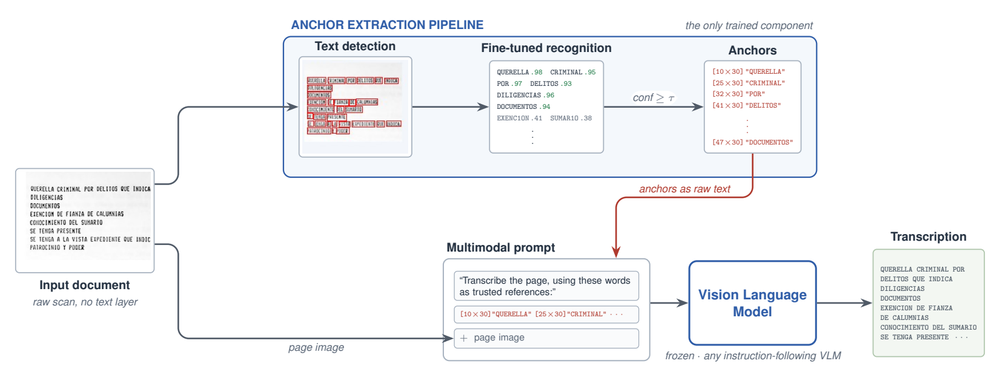

# HiT — coordinate-anchoring for historical-document OCR (experiment code)

This repository contains the code, test set, and reproduction instructions for the
experiments in Table 3 of the paper.

**HiT is the method:** it injects word-level coordinate anchors (`[XxY]word`) —
produced by a document-OCR recognizer fine-tuned on the **DHiSS** dataset — into the
prompt of a vision–language model (VLM), to improve transcription of Spanish
historical documents.

HiT is backbone-agnostic. Everything in this repository is **the same method (HiT)
applied to different VLM backbones**; the only thing that changes across experiments
is which VLM produces the transcription. For every backbone we compare two conditions:

- **without HiT** — the page image + a plain transcription instruction.
- **with HiT** — the same prompt, plus the DHiSS anchors appended to it.



*The HiT pipeline. The **anchor-extraction pipeline** (the only trained component) runs
text detection and a **DHiSS-fine-tuned recognizer** over the raw scan, keeps words above
a confidence threshold, and emits `[XxY]word` anchors. Those anchors are appended as raw
text to the multimodal prompt, alongside the page image, and a **frozen, instruction-following
VLM** produces the transcription.*

## Backbones included

All rows below are HiT; they differ only in the VLM backbone. Every **instruction-following
backbone is driven by the same runner, `run_vlm.py`** (olmOCR and olmOCR-2 identically);
Mistral-Small-4 is served with vLLM (`run_mistral4_vllm.py`) and GPT-4o goes over the
OpenAI API (`run_gpt4o.py`). WER is the Word Error Rate (lower is better), averaged over
the 14 test documents. `mode baseline` = without HiT; `mode append` = with HiT.

| Backbone | HF id / model | Runner | WER without HiT → with HiT |
|---|---|---|---|
| olmOCR | `allenai/olmOCR-7B-0225-preview` | `run_vlm.py` | 0.216 → **0.162** |
| olmOCR-2 | `allenai/olmOCR-2-7B-1025` | `run_vlm.py` | 0.464 → **0.156** |
| Gemma-4-12b | `google/gemma-4-12b-it` | `run_vlm.py` | 3.293 → **0.491** |
| Gemma-4-26B-A4B | `google/gemma-4-26b-a4b-it` | `run_vlm.py` | 0.418 → **0.317** |
| Qwen3-VL-30B-A3B | `Qwen/Qwen3-VL-30B-A3B-Instruct` | `run_vlm.py` | 0.471 → **0.317** |
| MiMo-VL-7B | `XiaomiMiMo/MiMo-VL-7B-RL` | `run_vlm.py` | 1.020 → **0.554** |
| Infinity-Parser2-Flash † | `infly/Infinity-Parser2-Flash` | `run_vlm.py` | 0.190 → **0.188** |
| Mistral-Small-4 | `mistralai/Mistral-Small-4-119B-2603-NVFP4` | `run_mistral4_vllm.py` | 0.284 → **0.236** |
| GPT-4o ‡ | OpenAI `gpt-4o` | `run_gpt4o.py` | 0.250 → **0.243** |

`olmOCR with HiT` (WER 0.162) is the paper's headline result; `olmOCR-2 with HiT` (0.156)
slightly surpasses it with a newer backbone.

† Infinity-Parser2-Flash is a layout-aware document parser, so it is driven with its
canonical JSON prompt (`--task-prompt-file infinity_prompt.txt`) and its JSON output is
reduced to plain text (`--postproc json_text`); with HiT the DHiSS anchors are appended on
top of that prompt. Strongest *without-HiT* WER of the set (0.190); HiT holds it (0.188).

‡ **GPT-4o needs an OpenAI API key** — provide it via `export OPENAI_API_KEY="..."` or
`--openai-api-key`; no key is stored in this repository. Everything else runs locally.

> **Scope.** The remaining backbones and the specialized/pipeline OCR systems reported in
> the paper are not duplicated here.

## Repository layout

```
.
├── README.md
├── run_experiments.sh          # reference commands for the whole pipeline
├── infinity_prompt.txt         # canonical layout prompt for Infinity-Parser2-Flash
├── environments/               # conda environments, one per pipeline stage
│   ├── env_render_and_anchors.yml
│   ├── env_vlm_runners.yml
│   ├── env_mistral4_vllm.yml
│   └── env_metrics.yml
├── data/
│   ├── pdfs/                    # test set: 14 PDF documents (244 pages)
│   └── gt/                      # ground-truth transcriptions (DOCxx_GT.txt)
├── ocr_weights/                # DHiSS-fine-tuned recognizers (the anchor sources)
│   ├── DHiSS_finetuning_v2_vitstr_base_10.pt                 # DHiSS+ · ViTSTR (used for all paper anchors)
│   ├── DHiSS_finetuning_v2_parseq_10.pt                      # DHiSS+ · ParSeq
│   ├── DHiSS_finetuning_v1_corrected_full_vitstr_base_10.pt  # DHiSS · ViTSTR
│   └── DHiSS_finetuning_v1_corrected_full_parseq_10.pt       # DHiSS · ParSeq
├── finetuning/                 # how those recognizers were fine-tuned on DHiSS (doctr)
├── external_datasets/          # HiT validated on public corpora — code + results (no Surya)
│   ├── rodrigo/                #   Spanish manuscript (in-domain for DHiSS)
│   └── finebooks/              #   printed multilingual books (official BHL leaderboard)
├── docs/                       # figures (hit_pipeline.png / .pdf)
├── src/
│   ├── ocr_inference.py        # the anchor engine — IMPORTABLE LIBRARY (not a script)
│   ├── render_pages.py         # stage 0: PDF pages -> 2048px PNGs
│   ├── gen_dhiss_anchors.py    # stage 1: cache the DHiSS anchors per page
│   ├── run_vlm.py              # stage 2: HiT on instructable VLMs (olmOCR, olmOCR-2, Gemma-4, Qwen3-VL, MiMo-VL, Infinity)
│   ├── run_mistral4_vllm.py    # stage 2: HiT on Mistral-Small-4 via a local vLLM server
│   ├── run_gpt4o.py            # stage 2: HiT on GPT-4o via the OpenAI API
│   └── compute_metrics.py      # stage 3: 13 metrics (BLEU, ROUGE, BERTScore, WER, CER, ...)
├── anchors/                    # (generated) cached DHiSS anchors
├── page_images/                # (generated) rendered page PNGs
└── results/                    # (generated) transcriptions, one folder per experiment
```

## Test set

14 Spanish historical documents (244 pages total), rendered at 2048 px on the
longest side. Ground truth is a manual transcription per document, in
`data/gt/DOCxx_GT.txt`. Metrics are computed per document and averaged.

## Additional material

- **`ocr_weights/`** ships all four fine-tuned anchor recognizers — **DHiSS** and
  **DHiSS+**, each as **ViTSTR** and **ParSeq**. DHiSS+ · ViTSTR produced every anchor in
  the paper; the others support ablations (any is selectable via `--reco-model`).
- **`finetuning/`** documents how those recognizers were fine-tuned on the DHiSS dataset
  (doctr recognition format, hyperparameters, and the training command).
- **`external_datasets/`** validates HiT beyond the internal test set, on two public
  corpora — **Rodrigo** (Spanish manuscript) and **finebooks/BHL** (printed multilingual,
  with the official BHL leaderboard metric). Each ships code, predictions, per-document
  metric pickles, and a results summary. Backbone: olmOCR-2 via vLLM; conditions: baseline,
  HiT with a generic anchor, and HiT with the in-domain DHiSS+ anchor.

## Environments

Different stages need different dependencies (CUDA builds, `transformers` versions,
etc.), so we provide four conda environments. Create the one you need with, e.g.:

```bash
conda env create -f environments/env_render_and_anchors.yml
```

| Environment file | Used for |
|---|---|
| `env_render_and_anchors.yml` | `render_pages.py`, `gen_dhiss_anchors.py`, `run_gpt4o.py` — imports the `ocr_inference.py` anchor engine (doctr + olmocr renderer + openai) |
| `env_vlm_runners.yml` | `run_vlm.py` (olmOCR, olmOCR-2, Gemma-4, Qwen3-VL, MiMo-VL, Infinity) |
| `env_mistral4_vllm.yml` | the vLLM server + `run_mistral4_vllm.py` client |
| `env_metrics.yml` | `compute_metrics.py` |
| `env_external_datasets.yml` | `external_datasets/` runners (adds `onnxtr`; vLLM via the mistral env) |

## How to run

All commands are run **from the repository root**. See `run_experiments.sh` for the
exact, copy-pasteable sequence. In short:

```bash
# stage 0 + 1  (conda activate the render/anchors env)
python src/render_pages.py     --pdf-folder data/pdfs --target-dim 2048 --out-dir page_images/2048
python src/gen_dhiss_anchors.py --pdf-folder data/pdfs --reco-model DHiSS_v2_vitstr_base \
                                --ocr-threshold 0.90 --gpu 0 --out-dir anchors/DHiSS_v2_vitstr_base_th90

# stage 2  (conda activate env_vlm_runners) — each backbone: baseline (without HiT) and append (with HiT)
python src/run_vlm.py --model allenai/olmOCR-7B-0225-preview --mode baseline --output-folder olmocr_baseline  --gpu 0
python src/run_vlm.py --model allenai/olmOCR-7B-0225-preview --mode append   --output-folder olmocr_append    --gpu 0
python src/run_vlm.py --model allenai/olmOCR-2-7B-1025       --mode baseline --output-folder olmocr2_baseline --gpu 0
python src/run_vlm.py --model allenai/olmOCR-2-7B-1025       --mode append   --output-folder olmocr2_append   --gpu 0
# Infinity-Parser2-Flash uses its canonical prompt + JSON post-processing:
python src/run_vlm.py --model infly/Infinity-Parser2-Flash --mode baseline --output-folder infinity2flash_baseline --gpu 0 --task-prompt-file infinity_prompt.txt --postproc json_text
python src/run_vlm.py --model infly/Infinity-Parser2-Flash --mode append   --output-folder infinity2flash_append   --gpu 0 --task-prompt-file infinity_prompt.txt --postproc json_text
# ... Gemma-4, Qwen3-VL-30B, MiMo-VL, Mistral-Small-4 (vLLM): see run_experiments.sh

# GPT-4o over the OpenAI API  (env_render_and_anchors; export OPENAI_API_KEY first)
python src/run_gpt4o.py --pdf-folder data/pdfs --mode baseline --output-folder gpt4o_baseline
python src/run_gpt4o.py --pdf-folder data/pdfs --mode append --reco-model DHiSS_v2_vitstr_base --output-folder gpt4o_append

# stage 3  (conda activate the metrics env)
python src/compute_metrics.py --results-dir results --gt-dir data/gt --out metrics.csv
```

### Notes

- **DHiSS anchors** are backbone-agnostic: generate them once (stage 1); every backbone
  in stage 2 reuses the same cached `anchors/` directory in its *with-HiT* condition.
- **DHiSS recognizer weights.** The four fine-tuned recognizers (DHiSS / DHiSS+ ×
  ViTSTR / ParSeq) are hosted on the Hugging Face Hub; fetch them into `ocr_weights/`
  with `python ocr_weights/download.py` (see `ocr_weights/README.md`).
  `DHiSS_v2_vitstr_base` produced the reported anchors; pick any via `--reco-model`.
- **`ocr_inference.py` is a library, not a script.** It exposes the anchor engine
  (`initialize_ocr_model`, `get_anchor_with_ocr_model`, `SUPPORTED_MODELS`) that the
  runners import. Transcription is run by `run_vlm.py` / `run_mistral4_vllm.py` / `run_gpt4o.py`.
- **Mistral-Small-4** is not loaded through `transformers`; it is served by vLLM and
  queried over an OpenAI-compatible API. The serving command (including the flags
  needed on Blackwell / sm_120 GPUs) is documented at the top of `run_mistral4_vllm.py`
  and in `run_experiments.sh`.
- **Determinism.** VLM decoding uses greedy decoding (`do_sample=False`,
  `temperature=0`), so re-runs are stable up to kernel-level nondeterminism.
